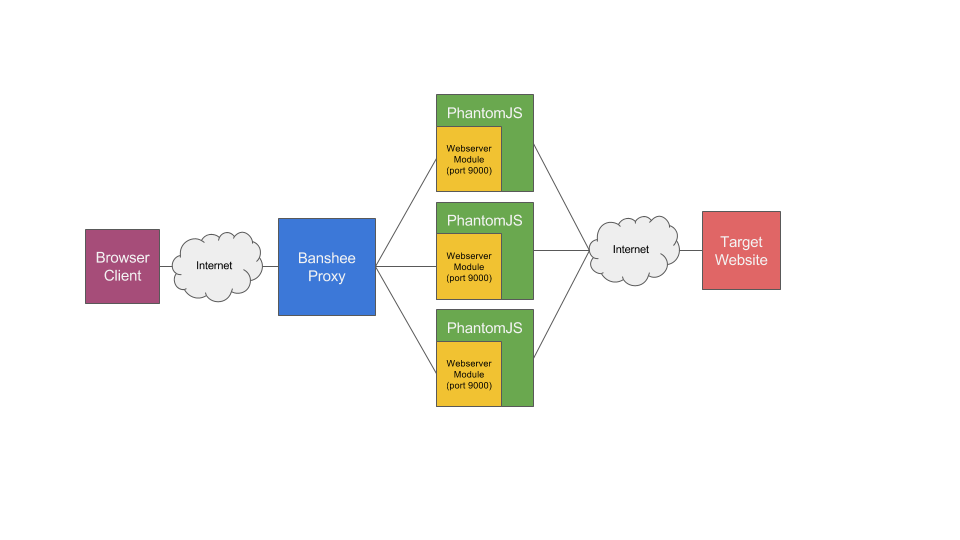

# Banshee
A custom built Web Render Proxy that uses a pool of PhantomJS instances to provide SEO for JavaScript apps

######Things to keep in mind
1. This is a POC / Experiment
2. To go to production it needs MUCH better error handling and logging
3. Implementing a caching strategy in front or inside the proxy code is necessary

######Known issues
1. The QT library used by PhantomJS leaks memory if image loading is not enabled when starting PhantomJS.  To address this, code is present to detect loading of images and abort those requests. [Link to issue](https://github.com/ariya/phantomjs/issues/12903).
2. Memory usage with PhantomJS 2 on OSX seems to have big issues! Use a previous binary distribution.  I'm seeing 5GB usage by a single instance of PhantomJS, and subsequent crashes.  Memory usage and performance is excellent on Linux ;) 

##Architecture

##Requirements
JavaScript, Node.js, and PhantomJS are required to run.

##Installation
1. Install PhantomJS locally
2. Clone this repository
3. Run "npm install" in the local repository directory
4. Change the config.json file's "targetHost" property to the site you want to front
5. Run "node banshee.js"
6. In a browser, navigate to "http://localhost:8888"

######Credit where credit is due.
The following articles and repositories inspired this project
* [Sumgmug Sorcery PhantomJS at scale](http://sorcery.smugmug.com/2013/12/17/using-phantomjs-at-scale/)
* [Phantom Manager](https://github.com/FTBpro/phantom-manager)
* [PhearJS](https://github.com/Tomtomgo/phearjs_)
